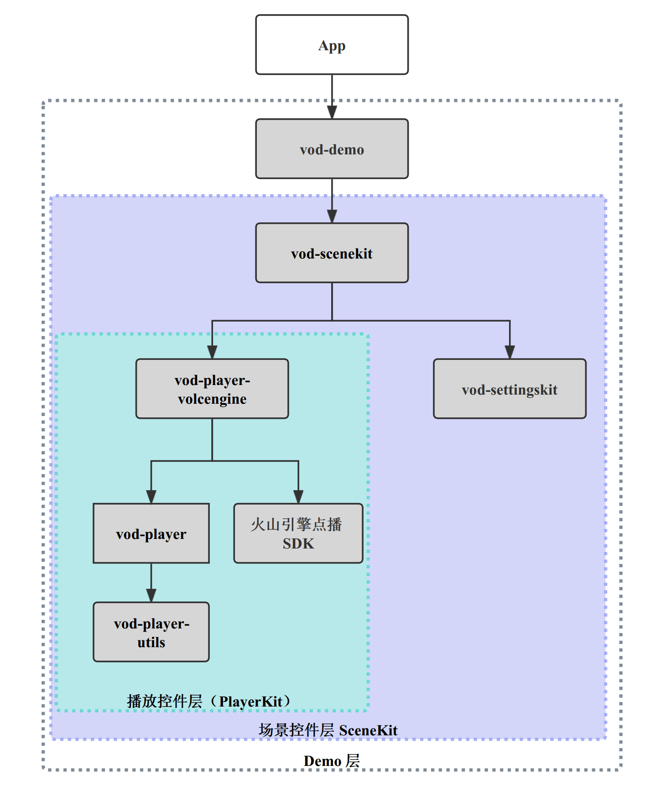

# VEVodDemo-android

VEVodDemo-android 是火山引擎视频云点播 SDK Android 端的开源 Demo. 我们提供了
`场景控件层（vod-scenekit）` 帮助业务快速搭建常见的点播场景。

Demo 中实现了常见的三种播放场景：
- 短视频场景（Short Video）- 类抖音首页竖版视频场景
- 中视频场景（Feed Video） - 类西瓜视频 Feed 视频流场景
- 长视频场景（Long Video） - 类爱奇艺/腾讯视频/优酷视频的电视剧/电影场景

针对短视频、中视频场景，我们提供了 `短视频场景控件`、`中视频场景控件` 进一步简化接入。 业务可将 `vod-scenekit`
模块引入工程，添加数据源即可快速搭建播放场景。无需关心播放器如何使用。

# 目录结构

```text
|--VEVodDemo-android
|--|--app               // 主 app （壳工程）
|--|--vod-demo-api      // vod-demo 模块与壳工程交互接口（组件化）
|--|--vod-demo          // 业务 demo 层
|--|--vod-scenekit      // 场景控件层
|--|--vod-playerkit     // 播放控件层
|--|--vod-settingskit   // 播放设置模块
```

# 编译运行
1. <b>Demo 需要设置 AppId 和 License 才能成功运行，否则会抛出异常。</b> 请联系火山引擎商务获取体验 License 文件和 AppId。获取到 License 文件后请将 License 放置在 app 的 assets 文件夹中。

设置方式：
> 修改 VEVodDemo-android/app/src/main/java/com/bytedance/volc/voddemo/App.java
```java
public class App extends Application {
   private static final String APP_ID = "your app id";
   // 比如：VEVodDemo-android/app/src/main/assets/license2/vod.lic 路径下的 assets uri 对应为：assets:///license2/vod.lic
   private static final String LICENSE_URI = "your license assets uri";
   // ... 省略
}
```

2. Android Studio 打开 `VEVodDemo-android` 文件夹，点击运行 `app`.

# 快速接入
我们提供了三种接入方式，接入方可以根据自己使用场景，选择接入。
1. [场景控件层接入](vod-scenekit)
2. [播放控件层接入](vod-playerkit)
3. [播放器 SDK 接入](https://www.volcengine.com/docs/4/65774)

接入建议:
1. 复用业务已有 短视频流 / Feed 流？
   * 是 - 看问题 2
   * 否 - 使用 [场景控件层接入](vod-scenekit)
2. 复用业务已有视频控件 UI 代码和播放器封装层代码？
   * 是 - 使用 [播放器 SDK 接入](https://www.volcengine.com/docs/4/65774)
   * 否 - 使用 [播放控件层接入](vod-playerkit)


# 依赖分层
> Tips：依赖图 + 核心类的关系可以帮助开发者快速熟悉 Demo 工程结构！


### 业务 Demo 层（[vod-demo](vod-demo))
#### 场景页面
场景页面 = 场景控件 + 业务 API 数据获取 
* 短视频页面 - [ShortVideoFragment](vod-demo/src/main/java/com/bytedance/volc/voddemo/ui/video/scene/shortvideo/ShortVideoFragment.java)
* 中视频页面 - [FeedVideoFragment](vod-demo/src/main/java/com/bytedance/volc/voddemo/ui/video/scene/feedvideo/FeedVideoFragment.java)
* 长视频页面 - [LongVideoFragment](vod-demo/src/main/java/com/bytedance/volc/voddemo/ui/video/scene/longvideo/LongVideoFragment.java)
* 视频详情页面 - [DetailVideoFragment](vod-demo/src/main/java/com/bytedance/volc/voddemo/ui/video/scene/detail/DetailVideoFragment.java)

### 场景控件层 （[vod-scenekit](vod-scenekit))
#### 场景控件
场景控件 = 页面控件 + 下拉刷新控件 + 上拉加载控件
* 短视频场景控件 - [ShortVideoSceneView](vod-scenekit/src/main/java/com/bytedance/volc/vod/scenekit/ui/video/scene/shortvideo/ShortVideoSceneView.java) 
* 中视频场景控件 - [FeedVideoSceneView](vod-scenekit/src/main/java/com/bytedance/volc/vod/scenekit/ui/video/scene/feedvideo/FeedVideoSceneView.java)
#### 页面控件
页面控件 = RecyclerView/ViewPager2 + 播放控件
* 短视频页面控件 - [ShortVideoPageView](vod-scenekit/src/main/java/com/bytedance/volc/vod/scenekit/ui/video/scene/shortvideo/ShortVideoPageView.java)
* 中视频页面控件 - [FeedVideoPageView](vod-scenekit/src/main/java/com/bytedance/volc/vod/scenekit/ui/video/scene/feedvideo/FeedVideoPageView.java) 

### 播放控件层 （[vod-playerkit](vod-playerkit)）
#### 播放器接口层 （[vod-player](vod-playerkit/vod-player)）
* 播放源 - [MediaSource](vod-playerkit/vod-player/src/main/java/com/bytedance/playerkit/player/source/MediaSource.java)
* 播放器 - [Player](vod-playerkit/vod-player/src/main/java/com/bytedance/playerkit/player/Player.java)
* 播放器默认实现 - [AVPlayer](vod-playerkit/vod-player/src/main/java/com/bytedance/playerkit/player/AVPlayer.java)
* 视频控件 - [VideoView](vod-playerkit/vod-player/src/main/java/com/bytedance/playerkit/player/playback/VideoView.java)
* 播放流程 - [PlaybackController](vod-playerkit/vod-player/src/main/java/com/bytedance/playerkit/player/playback/PlaybackController.java)
* 播放浮层 - [VideoLayer](vod-playerkit/vod-player/src/main/java/com/bytedance/playerkit/player/playback/VideoLayer.java)
* 浮层管理 - [VideoLayerHost](vod-playerkit/vod-player/src/main/java/com/bytedance/playerkit/player/playback/VideoLayerHost.java)

#### 火山引擎播放器实现层 ([vod-player-volcengine](vod-playerkit/vod-player-volcengine))
* 火山播放内核封装 - [VolcPlayer](vod-playerkit/vod-player-volcengine/src/main/java/com/bytedance/playerkit/player/volcengine/VolcPlayer.java)
* 火山播放内核工厂 - [TTVideoEngineFactory](vod-playerkit/vod-player-volcengine/src/main/java/com/bytedance/playerkit/player/volcengine/VolcPlayer.java)
* SDK 初始化 - [VolcPlayerInit](vod-playerkit/vod-player-volcengine/src/main/java/com/bytedance/playerkit/player/volcengine/VolcPlayerInit.java)
* 播放器全局配置 - [VolcConfigGlobal](vod-playerkit/vod-player-volcengine/src/main/java/com/bytedance/playerkit/player/volcengine/VolcConfigGlobal.java)
* 播放器实例配置 - [VolcConfig](vod-playerkit/vod-player-volcengine/src/main/java/com/bytedance/playerkit/player/volcengine/VolcConfig.java)

# Issue

有任何问题可以提交 github issue，我们会定期 check 解决。

# PullRequests

暂不接受 PullRequests。

# 火山引擎点播 SDK 官网文档
- [集成准备](https://www.volcengine.com/docs/4/65774)
- [快速开始](https://www.volcengine.com/docs/4/112130)
- [ChangeLog](https://www.volcengine.com/docs/4/66437)

# License

```text
Copyright 2021 bytedance

Licensed under the Apache License, Version 2.0 (the "License");
you may not use this file except in compliance with the License.
You may obtain a copy of the License at

   http://www.apache.org/licenses/LICENSE-2.0

Unless required by applicable law or agreed to in writing, software
distributed under the License is distributed on an "AS IS" BASIS,
WITHOUT WARRANTIES OR CONDITIONS OF ANY KIND, either express or implied.
See the License for the specific language governing permissions and
limitations under the License.
```