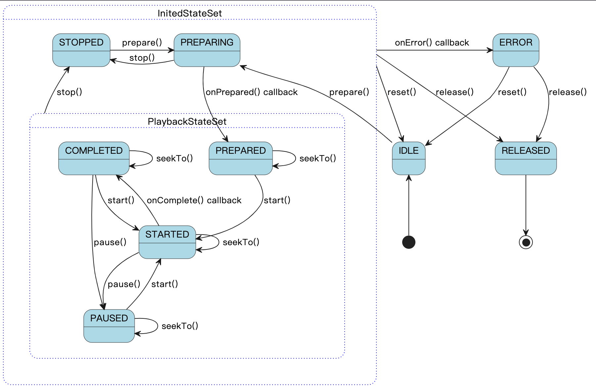

# 播放器状态机设计


## 状态机说明
* Player 状态枚举如下：

| 状态枚举      | 说明         |
|-----------|------------|
| IDLE      | 初始化        |
| PREPARING | 正在 prepare |
| PREPARED  | prepare 完成 |
| STARTED   | 开始播放       |
| PAUSED    | 暂停播放       |
| COMPLETED | 播放完成       |
| STOPPED   | 播放停止       |
| RELEASED  | 播放器释放      |
| ERROR     | 播放出错       |

* Player 状态获取 API
```java
interface Player {
    
    @PlayerState
    int getState();

    /**
     * @see #STATE_IDLE
     */
    boolean isIDLE();

    /**
     * @see #STATE_PREPARING
     */
    boolean isPreparing();

    /**
     * @see #STATE_PREPARED
     */
    boolean isPrepared();

    /**
     * @see #STATE_STARTED
     */
    boolean isPlaying();

    /**
     * @see #STATE_PAUSED
     */
    boolean isPaused();

    /**
     * @see #STATE_COMPLETED
     */
    boolean isCompleted();

    /**
     * @see #STATE_STOPPED
     */
    boolean isStopped();

    /**
     * @see #STATE_RELEASED
     */
    boolean isReleased();

    /**
     * @see #STATE_ERROR
     */
    boolean isError();

    /**
     * @return true if {@link #getState()} is in playback state.
     * <ul>
     *   <li>{@link #STATE_PREPARED}</li>
     *   <li>{@link #STATE_STARTED}</li>
     *   <li>{@link #STATE_PAUSED}</li>
     *   <li>{@link #STATE_COMPLETED}</li>
     * </ul>
     */
    boolean isInPlaybackState();
}
```


## 状态机强检查机制
Note: 状态机强检查方法只能在特定的 state 下调用，否则会抛出 IllegalStateException 异常。

| 方法           | 有效状态                                                                       |
|--------------|----------------------------------------------------------------------------|
| prepare      | IDLE, STOPPED                                                              |
| setStartTime | IDLE, STOPPED                                                              |
| seekTo       | PREPARED, STARTED, PAUSED, COMPLETED                                       |
| start()      | PREPARED, STARTED, PAUSED, COMPLETED                                       |
| pause()      | PREPARED, STARTED, PAUSED, COMPLETED                                       |
| stop()       | PREPARING, PREPARED, STARTED, PAUSED, COMPLETED, STOPPED                   |
| reset()      | All states                                                                 |
| release()    | All states                                                                 |