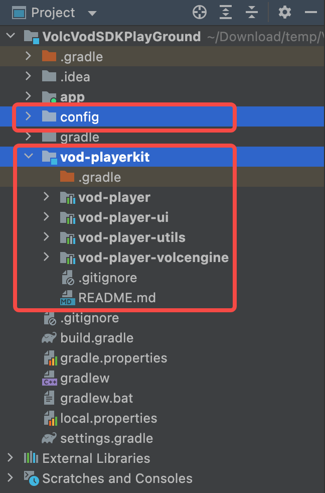

# 播放控件层接入

播放控件层（PlayerKit）是火山引擎开源的播放器 UI 控件，主要功能如下：

1. 封装了[火山引擎播放器 SDK](https://www.volcengine.com/docs/4/65774)，屏蔽了播放器的使用细节。
2. 提供了 VideoView 控件，使用者只需要关注 View 层的实现即可。
3. 基于 VideoView 提供了播放界面浮层管理，方便基于 VideoLayer 实现灵活、可复用的播放 UI。
4. 集成了默认风格的播放界面，帮助快速搭建播放场景。（可选）

## PlayerKit 目录结构

```text
|--gradle-config              // gradle 配置目录
|--vod-playerkit              // 播放控件层根目录
|--|--vod-player              // 播放器适配层（定义了一套标准播放器接口）
|--|--vod-player-volcengine   // 火山引擎播放器实现模块
|--|--vod-player-utils        // 工具类模块
```

| 模块 | 描述 |是否必须 | 介绍 |
| :---- | :---- | :---- | :---- |
| vod-player | 播放器适配层模块 | 必须 | 1. 定义了控件层播放器的标准接口，方便适配各种播放器。<br>2. 封装了VideoView 和 VideoLayer，方便客户基于 VideoLayer 实现灵活/高复用的播放UI。<br>3. 封装了 PlaybackController 把一次播放 Session 开始/结束时 Player/VideoView/MediaSource 的相互调用关系串起来。 |
| vod-player-volcengine | 火山引擎播放器实现模块 | 必须 | 1. 用播件层的播放器接口，实现了火山引擎播放器.<br>2. 封装了火山引擎播放器初始化模块，方便业务快速集成。火山引擎播放器 [官方文档](https://www.volcengine.com/docs/4/52) |
| vod-player-util | 工具类模块 | 必须 | 各模块需要的常见工具类如 logcat 输出等 |

## PlayerKit 集成

1. clone git 仓库

```shell
git clone https://github.com/volcengine/VEVodDemo-android
cd VEVodDemo-android
```

2. 拷贝控件层模块

拷贝如下几个文件夹到工程根目录下，层级结构与 VEVodDemo-Android 保持一致
```text
gradle-config
vod-playerkit
```
> 拷贝完成后，建议做一次 git commit，并在 commit message 中记录 VEVodDemo-android 当前最新的 commit id。后续因业务需要可能会更改源码，那这次 commit 就可以起到追溯作用。

3. 确保 project 根目录下的 build.gradle 文件中的 repositories 中配置了`google`、`mavenCentral()` 和 `火山引擎 maven` 服务。

```groovy
allprojects {
    repositories {
        google()
        mavenCentral()
        maven {
            url "https://artifact.bytedance.com/repository/Volcengine/" // 火山引擎 maven 服务
        }
    }
}
```

4. 在 settings.gradle 中引入 PlayerKit 模块

```groovy
include ':app'

apply from: file("gradle-config/vod_playerkit_library_settings.gradle")
```

5. 在 App module 的 build.gradle 中引入 PlayerKit 依赖

```groovy
// 在 app 的 build.gradle 文件添加 Java 8 支持
android {
    // ...
    compileOptions {
        sourceCompatibility JavaVersion.VERSION_1_8
        targetCompatibility JavaVersion.VERSION_1_8
    }
}

dependencies {
    api project(":vod-playerkit:vod-player")
    api project(":vod-playerkit:vod-player-utils")
    api project(":vod-playerkit:vod-player-volcengine")
}
```

6. App 权限及混淆规则配置
- 添加点播 SDK 应用权限、混淆规则。参考： [集成准备](https://www.volcengine.com/docs/4/65774)
- 场景控件无新增权限，混淆规则已配置在 `consumer-rules.pro` 使用方无需关心

7. sync 一下 gradle，AndroidStudio 中 vod-playerkit 模块正确引入，并没有报错则完成集成.



## PlayerKit 快速开始

下面用一个简单的例子快速展示 PlayerKit 的使用方式。完成后即可完成类似西瓜视频单个视频的播放界面，包含各种播放相关功能。 在完成 PlayerKit 的集成后，以下代码可以直接 copy
到工程中使用。

1. 初始化 SDK

> App.java

```java
public class App extends Application {

    @Override
    public void onCreate() {
        super.onCreate();

        L.ENABLE_LOG = true; // 控件层 logcat 开关

        VolcPlayerInit.AppInfo appInfo = new VolcPlayerInit.AppInfo.Builder()
                .setAppId("your app id")
                .setAppName("your app English name")
                .setAppRegion("china")
                .setAppChannel("your app channel")
                .setAppVersion(BuildConfig.VERSION_NAME)
                .setLicenseUri("your license assets path")
                .build();
        VolcPlayerInit.init(this, appInfo);
    }
}
```

* VolcPlayerInit 中实现了 [快速开始](https://www.volcengine.com/docs/4/65783) 中初始化部分，只需要传入相关初始化参数即可。
* 初始化需要的 appId/appName/licenseUri 等信息请登陆火山引擎点播控制台获取,
  参考官方文档: [管理应用](https://www.volcengine.com/docs/4/65772)

2. 使用 VideoView 进行播放

> simple_video_activity.xml

```xml
<?xml version="1.0" encoding="utf-8"?>
<FrameLayout xmlns:android="http://schemas.android.com/apk/res/android"
    android:layout_width="match_parent" 
    android:layout_height="match_parent"
    android:background="#000000">

    <com.bytedance.playerkit.player.playback.VideoView 
        android:id="@+id/videoView"
        android:layout_width="match_parent" 
        android:layout_height="match_parent" />

</FrameLayout>
```

> SimpleVideoActivity.java

```java
public class SimpleVideoActivity extends AppCompatActivity {

    private VideoView videoView;

    public static void intentInto(Activity activity) {
        Intent intent = new Intent(activity, SimpleVideoActivity.class);
        activity.startActivity(intent);
    }

    @Override
    protected void onCreate(Bundle savedInstanceState) {
        super.onCreate(savedInstanceState);
        setContentView(R.layout.simple_video_activity);

        ActionBar actionBar = getSupportActionBar();
        if (actionBar != null) {
            actionBar.hide();
        }

        // 1. create VideoView instance
        videoView = findViewById(R.id.videoView);

        // 2. create VideoLayerHost instance. Add Layers to VideoLayerHost.
        VideoLayerHost layerHost = new VideoLayerHost(this);
        layerHost.addLayer(new GestureLayer());
        layerHost.addLayer(new FullScreenLayer());
        layerHost.addLayer(new CoverLayer());
        layerHost.addLayer(new TimeProgressBarLayer());
        layerHost.addLayer(new TitleBarLayer());
        layerHost.addLayer(new QualitySelectDialogLayer());
        layerHost.addLayer(new SpeedSelectDialogLayer());
        layerHost.addLayer(new MoreDialogLayer());
        layerHost.addLayer(new TipsLayer());
        layerHost.addLayer(new SyncStartTimeLayer());
        layerHost.addLayer(new VolumeBrightnessIconLayer());
        layerHost.addLayer(new VolumeBrightnessDialogLayer());
        layerHost.addLayer(new TimeProgressDialogLayer());
        layerHost.addLayer(new PlayPauseLayer());
        layerHost.addLayer(new LockLayer());
        layerHost.addLayer(new LoadingLayer());
        layerHost.addLayer(new PlayErrorLayer());
        layerHost.addLayer(new PlayCompleteLayer());
        layerHost.addLayer(new LogLayer());

        // 3. attach VideoLayerHost to VideoView
        layerHost.attachToVideoView(videoView);

        // 4. config VideoView
        videoView.selectDisplayView(DisplayView.DISPLAY_VIEW_TYPE_SURFACE_VIEW);
        videoView.setDisplayMode(DisplayModeHelper.DISPLAY_MODE_ASPECT_FIT);

        // 5. create PlaybackController and bind VideoView
        PlaybackController controller = new PlaybackController();
        controller.bind(videoView);

        // 6. create MediaSource and bind into VideoView
        MediaSource mediaSource = createDirectUrlMultiQualityMediaSource();
        //MediaSource mediaSource = createDirectUrlSimpleMediaSource();
        //MediaSource mediaSource = createVidMediaSource();
        videoView.bindDataSource(mediaSource);
    }

    /**
     * 创建多分辨率播放源，配合 QualitySelectDialogLayer 可以默认实现清晰度切换功能。
     * 下面使用的 url 需要替换成真实的播放地址
     */
    private MediaSource createDirectUrlMultiQualityMediaSource() {
        MediaSource mediaSource = new MediaSource(UUID.randomUUID().toString(), MediaSource.SOURCE_TYPE_URL);

        Track track1 = new Track();
        track1.setTrackType(Track.TRACK_TYPE_VIDEO);
        track1.setUrl("http://example.com/video_360p.mp4");
        track1.setQuality(new Quality(Quality.QUALITY_RES_360, "360P"));

        Track track2 = new Track();
        track2.setTrackType(Track.TRACK_TYPE_VIDEO);
        track2.setUrl("http://example.com/video_480p.mp4");
        track2.setQuality(new Quality(Quality.QUALITY_RES_480, "480P"));

        Track track3 = new Track();
        track3.setTrackType(Track.TRACK_TYPE_VIDEO);
        track3.setUrl("http://example.com/video_720p.mp4");
        track3.setQuality(new Quality(Quality.QUALITY_RES_720, "720P"));

        Track track4 = new Track();
        track4.setTrackType(Track.TRACK_TYPE_VIDEO);
        track4.setUrl("http://example.com/video_1080p.mp4");
        track4.setQuality(new Quality(Quality.QUALITY_RES_1080, "1080P"));

        mediaSource.setTracks(Arrays.asList(track1, track2, track3, track4));
        return mediaSource;
    }

    /**
     * 快速创建单清晰度播放源
     */
    private MediaSource createDirectUrlSimpleMediaSource() {
        String url = "http://example.com/video_480p.mp4"; // 必传
        // media Id 和 cacheKey 若不指定，内部会自动生成
        return MediaSource.createUrlSource(/*mediaId*/null, url, /*cacheKey*/null);
    }

    /**
     * 快速创建 vid 播放源
     */
    private MediaSource createVidMediaSource() {
        String mediaId = "your video id"; // 必传
        String playAuthToken = "your video id's playAuthToken"; // 必传
        return MediaSource.createIdSource(mediaId, playAuthToken);
    }

    @Override
    protected void onResume() {
        super.onResume();
        // 7. start playback in onResume
        videoView.startPlayback();
    }

    @Override
    protected void onPause() {
        super.onPause();
        // 8. pause playback in onResume
        videoView.pausePlayback();
    }

    @Override
    protected void onDestroy() {
        super.onDestroy();
        // 9. stop playback in onDestroy
        videoView.stopPlayback();
    }

    @Override
    public void onBackPressed() {
        // 10. handle back pressed event
        if (videoView != null && videoView.layerHost().onBackPressed()) {
            return;
        }
        super.onBackPressed();
    }
}
```

播放控件层的更多用法请参考[场景控件层](../vod-scenekit/README.md)的实现。