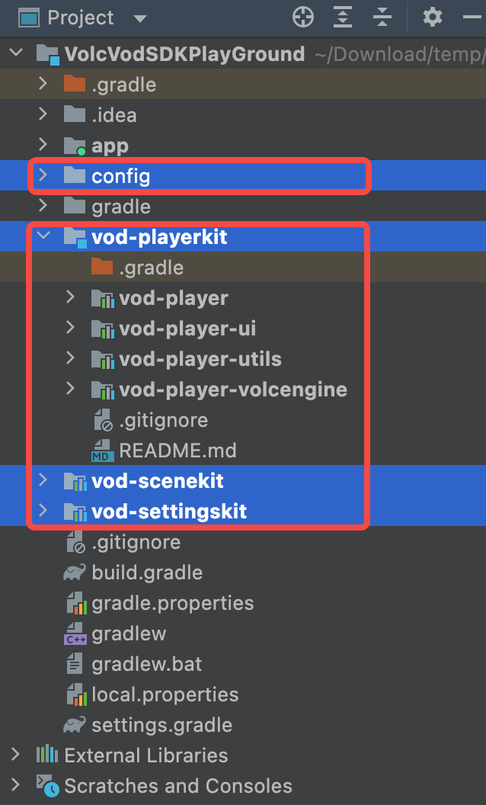

# 场景控件层接入

视频场景控件（SceneKit）是火山引擎开源的播放器场景组件。内部使用[播放控件层](../vod-playerkit/README.md)，实现了短视频和中视频的场景控件。

## SceneKit 目录结构

```text
|--config               // gradle 配置目录
|--vod-scenekit         // 场景控件根目录
|--vod-settingskit      // 播放设置模块
```

## SceneKit 集成

1. clone git 仓库

```shell
git clone https://github.com/volcengine/VEVodDemo-android
cd VEVodDemo-android
```

2. 确保 project 根目录下的 build.gradle 文件中的 repositories 中配置了`google`、`mavenCentral()` 和 `火山引擎 maven` 服务。

```groovy
allprojects {
    repositories {
        google()
        mavenCentral()
        maven {
            url "https://artifact.bytedance.com/repository/Volcengine/" // 火山引擎 maven 服务
        }
    }
}
```

3. 拷贝场景控件层模块

拷贝如下几个文件夹到工程根目录下，层级结构与 VEVodDemo-Android 保持一致

```text
config
vod-playerkit
vod-scenekit
vod-settingskit
```

4. 在 settings.gradle 中引入 SceneKit 模块

```groovy
include ':app'

gradle.ext.playerKitModulePrefix = 'volc-' // 可选配置。若想给引入的 module 添加前缀增加辨识度可以配置。
apply from: file("config/vod_playerkit_library_settings.gradle")
gradle.ext.sceneKitModulePrefix = 'volc-'  // 可选配置。若想给引入的 module 添加前缀增加辨识度可以配置。
apply from: file("config/vod_scenekit_library_settings.gradle")
```

5. 在 App module 的 build.gradle 中引入 SceneKit 依赖

```groovy
// 在 app 的 build.gradle 文件添加 Java 8 支持
android {
    // ...
    compileOptions {
        sourceCompatibility JavaVersion.VERSION_1_8
        targetCompatibility JavaVersion.VERSION_1_8
    }
}

dependencies {
    // 若配置了模块前缀为 volc-，则引入子模块需要以 volc- 作为前缀。没配置则不用。
    api project(":volc-vod-scenekit")
}
```

6. App 权限及混淆规则配置
    - 点播 SDK 应用权限、混淆规则参考： [集成准备](https://www.volcengine.com/docs/4/65774)
    - 场景控件无新增权限，混淆规则已配置在 `consumer-rules.pro` 使用方无需关心

7. sync 一下 gradle，AndroidStudio 中模块正确引入，并没有报错则完成集成.



## SceneKit 快速开始

1. 初始化 SDK

> App.java

```java
public class App extends Application {

    @Override
    public void onCreate() {
        super.onCreate();

        L.ENABLE_LOG = true; // 控件层 logcat 开关

        VolcPlayerInit.AppInfo appInfo = new VolcPlayerInit.AppInfo.Builder()
                .setAppId("your app id")
                .setAppName("your app English name")
                .setAppRegion("china")
                .setAppChannel("your app channel")
                .setAppVersion(BuildConfig.VERSION_NAME)
                .setLicenseUri("your license assets path")
                .build();
        VolcPlayerInit.init(this, appInfo);
    }
}
```

* VolcPlayerInit 中实现了 [快速开始](https://www.volcengine.com/docs/4/65783) 中初始化部分，只需要传入相关初始化参数即可。
* 初始化需要的 appId/appName/licenseUri 等信息请登陆火山引擎点播控制台获取,
  参考官方文档: [管理应用](https://www.volcengine.com/docs/4/65772)

2. 快速实现短视频场景

> ShortVideoActivity.java

```java
public class ShortVideoActivity extends AppCompatActivity {

    private ShortVideoSceneView mSceneView;

    @Override
    protected void onCreate(Bundle savedInstanceState) {
        super.onCreate(savedInstanceState);

        mSceneView = new ShortVideoSceneView(this);
        mSceneView.setRefreshEnabled(false);
        mSceneView.setLoadMoreEnabled(false);

        mSceneView.pageView().setLifeCycle(getLifecycle());
        mSceneView.pageView().setItems(createItems());

        setContentView(mSceneView);
    }

    private static List<VideoItem> createItems() {
        List<VideoItem> videoItems = new ArrayList<>();
        // 传入 videoUrl + coverUrl(可选)
        videoItems.add(VideoItem.createUrlItem("http://www.example.com/video_0.mp4", "http://www.example.com/cover_0.jpg"));
        videoItems.add(VideoItem.createUrlItem("http://www.example.com/video_1.mp4", "http://www.example.com/cover_1.jpg"));
        videoItems.add(VideoItem.createUrlItem("http://www.example.com/video_2.mp4", "http://www.example.com/cover_2.jpg"));
        videoItems.add(VideoItem.createUrlItem("http://www.example.com/video_3.mp4", "http://www.example.com/cover_3.jpg"));
        return videoItems;
    }
}
```

3. 快速实现中视频场景

> FeedVideoActivity.java

```java
public class FeedVideoActivity extends AppCompatActivity {

    private FeedVideoSceneView mSceneView;

    @Override
    protected void onCreate(Bundle savedInstanceState) {
        super.onCreate(savedInstanceState);

        mSceneView = new FeedVideoSceneView(this);
        mSceneView.setRefreshEnabled(false);
        mSceneView.setLoadMoreEnabled(false);

        mSceneView.pageView().setLifeCycle(getLifecycle());
        mSceneView.pageView().setItems(createItems());

        setContentView(mSceneView);
    }

    @Override
    public boolean onBackPressed() {
        if (mSceneView.onBackPressed()) {
            return true;
        }
        return super.onBackPressed();
    }

    private static List<VideoItem> createItems() {
        List<VideoItem> videoItems = new ArrayList<>();
        //传入 videoUrl + coverUrl(可选)
        videoItems.add(VideoItem.createUrlItem("http://www.example.com/video_0.mp4", "http://www.example.com/cover_0.jpg"));
        videoItems.add(VideoItem.createUrlItem("http://www.example.com/video_1.mp4", "http://www.example.com/cover_1.jpg"));
        videoItems.add(VideoItem.createUrlItem("http://www.example.com/video_2.mp4", "http://www.example.com/cover_2.jpg"));
        videoItems.add(VideoItem.createUrlItem("http://www.example.com/video_3.mp4", "http://www.example.com/cover_3.jpg"));
        return videoItems;
    }
}
```

4. 短/中视频场景实现下拉刷新 + 上拉加载(参考 vod-demo 模块中的实现)
    - 短视频场景，参考 [ShortVideoFragment](../vod-demo/src/main/java/com/bytedance/volc/voddemo/ui/video/scene/shortvideo/ShortVideoFragment.java)
    - 中视频场景，参考 [FeedVideoFragment](../vod-demo/src/main/java/com/bytedance/volc/voddemo/ui/video/scene/feedvideo/FeedVideoFragment.java)